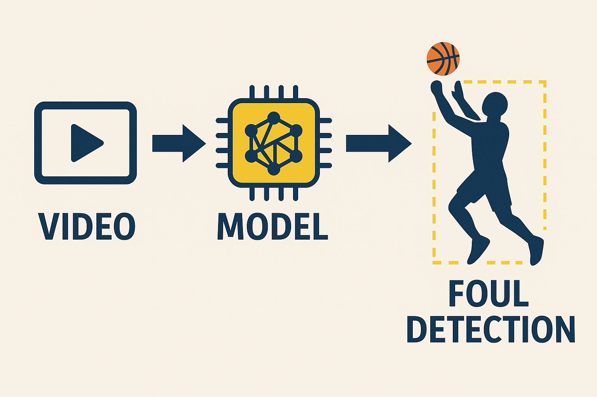

---
<div align="center">
  
</div>

# 🏀 Basketball-Foul-Detection

---

Автоматический конвейер для обнаружения фолов в баскетбольных матчах.  
Главная модель — **RF-DETR**; **Faster R-CNN** и **YOLOv12** рассматривались как базовые, но показали худшие результаты и приведены здесь только для полноты.

<p align="center">
  
  
  
</p>

---

## 📚 Оглавление
1. [Структура репозитория](#-структура-репозитория)
2. [Датасеты](#-датасеты)
3. [Конвейер валидации](#-конвейер-валидации)
4. [📁 Model Training](#-model-training)
5. [📁 Model Tuning](#-model-tuning)
6. [📁 Model Validation](#-model-validation)


---

## 📂 Структура репозитория
```text
📦 project-root
├── Faster R-CNN/        # эксперименты с Faster R-CNN
├── RF_DETR/             # основная модель и скрипты инференса
├── YOLOv12/             # эксперименты с YOLOv12
├── data_collection/     # сбор очищенных видео
├── dataset/
│   └── main/            # train / valid / test фреймы
├── ref_validation/      # LLM + RF-DETR сравнение
├── weights/             # чекпоинты моделей
└── README.md            # вы читаете его 😊
```
 
---

## 📊 Датасеты

| Назначение | Формат | Размер | Ссылка |
|------------|--------|--------|--------|
| Классификация кадров | `.jpg` / `.json` | 9 162 кадров | **Kaggle:** [nba-foul-detection] |
| Короткие видео-интервалы | `.mp4` | 3 h | *в процессе публикации* |
| Неаннотированные full-game видео | `.mkv` / `.mp4` | 25 GB | Google Drive (доступ по запросу) |

[nba-foul-detection]: https://www.kaggle.com/datasets/vladimirkalinovski/nba-foul-detection

---

## 🔄 Конвейер валидации

> Полный конвейер сравнивает решение **LLM** и **RF-DETR** на одинаковых видео-фрагментах.

1. **Загрузка видео** → декодирование + извлечение аудио (OpenCV / FFmpeg).  
2. **ASR** → Whisper выдаёт транскрипт с тайм-стемпами.  
3. **LLM** → prompt ⟶ *`foul`* / *`no_foul`* + `confidence`.  
4. **RF-DETR** → кадр-за-кадром детекция + эвристика фола → вердикт.  
5. **Сравнение** → Accuracy, Precision, Recall, F1, Agreement Rate.  

<details>
<summary>Метрики</summary>

| Метрика        | Формула                                          |
|----------------|--------------------------------------------------|
| Accuracy       | (TP + TN) / (P + N)                              |
| Precision      | TP / (TP + FP)                                   |
| Recall         | TP / (TP + FN)                                   |
| F1-score       | 2 · (P · R)/(P + R)                              |
| Agreement Rate | (# совпавших вердиктов) / (# всех случаев)       |

**TP** – оба сказали *foul* и это правда, **TN** – оба *no_foul*, **FP** – ложный фол, **FN** – пропущенный фол.
</details>

---

## 📁 Model Training

| Параметр | Значение |
|----------|----------|
| Архитектура | **SlowFast R50** из *PyTorchVideo* |
| Фреймворк | **PyTorch Lightning** + AMP |
| Аугментации | врем. сэмплинг · crop · flip · jitter · Gaussian&nbsp;noise |
| Дополнительно | **Mixup**, label smoothing, **OneCycleLR** |
| Журналирование | Google Colab GPU → чекпоинты + TensorBoard в Google Drive |

Ноутбук: [`RF_DETR/rf-detr-train.ipynb`](./RF_DETR/rf-detr-train.ipynb)

---

## 📁 Model Tuning

- **Optuna** подбирает learning-rate, dropout, weight-decay и др.  
- **Early Stopping** и checkpointing по лучшей val-accuracy.  
- `seen_videos.txt` исключает уже использованные клипы → без data leakage.  
- **Gradient Clipping** + частичное «заморозка» backbone для устойчивости.

---

## 📁 Model Validation

| Этап | Инструмент |
|------|-----------|
| ⚙️ Инференс модели | `RF_DETR/video_annotation.ipynb` |
| 📖 Инференс LLM | `ref_validation/ref_validation.ipynb` |
| 🏁 Подсчёт метрик | `ref_validation/ref_validation.ipynb` (раздел *Evaluation*) |

Вывод сохранён в `ref_validation/results.csv`.

---

## 🗃️ Базовые модели (Faster R-CNN & YOLOv12)

| Модель | Ноутбук | mAP@0.5 | Причина отказа |
|--------|---------|--------|----------------|
| Faster R-CNN | [`Faster R-CNN/r_cnn.ipynb`](./Faster%20R-CNN/r_cnn.ipynb) | 0.1 | медленно, переобучается |
| YOLOv12 | [`YOLOv12/train-yolo12.ipynb`](./YOLOv12/train-yolo12.ipynb) | 0.48 | хуже детектирует контакты |

---

## 🚀 Запуск

```bash
# 1. Установите зависимости
conda env create -f environment.yml
conda activate foul-detect

# 2. Скачайте веса основного чекпоинта
bash scripts/download_weights.sh  # (~250 MB)

# 3. Инференс на примере
python infer.py --video path/to/clip.mp4 --out results.json

